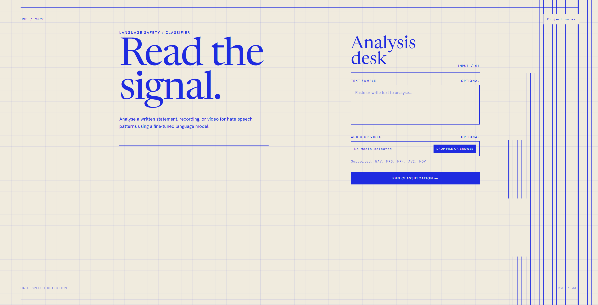
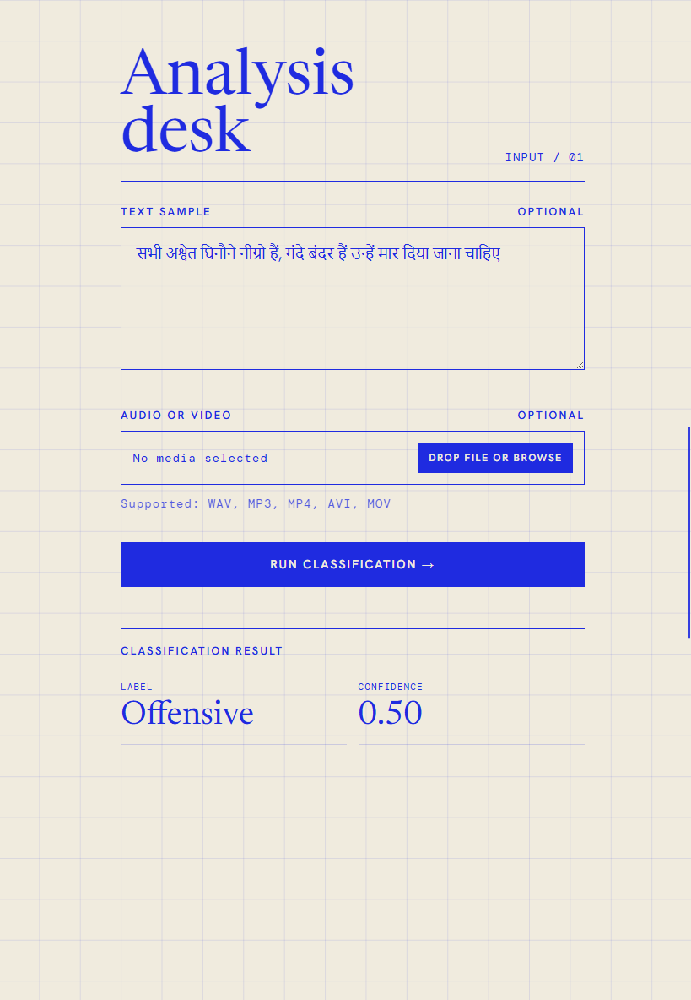

# Hate Speech Detection using BERT

A Flask-based web application that detects hate speech from **text, audio, and video** using a fine-tuned **BERT (Bidirectional Encoder Representations from Transformers)** model.

The application automatically extracts speech from audio and video files, translates the extracted text to English (if necessary), and classifies it into one of the following categories:

- Hate Speech
- Offensive Language
- No Hate

---

## Features

- Fine-tuned BERT model for hate speech detection
- Text classification
- Audio-to-text transcription
- Video-to-text extraction
- Automatic language translation to English
- Simple and responsive Flask web interface

---

## Tech Stack

### Backend
- Python
- Flask

### Machine Learning
- TensorFlow
- Hugging Face Transformers
- BERT

### Speech Processing
- SpeechRecognition
- FFmpeg

### Frontend
- HTML
- CSS
- JavaScript

---

## Project Structure

```text
Hate-Speech-Detection/
│
├── app.py
├── faster.py
├── requirements.txt
├── README.md
├── .gitignore
│
├── saved_model/
│   ├── config.json
│   ├── tokenizer.json
│   ├── tokenizer_config.json
│   ├── special_tokens_map.json
│   └── vocab.txt
│
├── static/
├── templates/
├── uploads/
└── images/
```

---

## Installation

### 1. Clone the repository

```bash
git clone https://github.com/xDAryanSharma/Hate-Speech-Detection.git
```

### 2. Move into the project

```bash
cd Hate-Speech-Detection
```

### 3. Create a virtual environment

Windows:

```bash
python -m venv myenv
```

Activate it:

```bash
myenv\Scripts\activate
```

### 4. Install dependencies

```bash
pip install -r requirements.txt
```

### 5. Download the trained model

The trained model (`tf_model.h5`) is not included because it exceeds GitHub's file size limit.

Download the model and place it inside:

```text
saved_model/
```

> **Model download:** *https://huggingface.co/ARYANSHARMA999/bert-hate-speech-detection*

### 6. Run the application

```bash
python app.py
```

Open your browser and visit:

```
http://127.0.0.1:5000
```

---

## Screenshots

### Home Page



---

### Text Prediction



---

## Dataset

The model was trained using the **Hate Speech and Offensive Language Dataset** by Davidson et al.

Dataset Repository:

https://github.com/t-davidson/hate-speech-and-offensive-language

---

## Future Improvements

- OCR support for images
- Explainable AI visualizations
- Batch file processing
- REST API support
- Docker deployment

---

## Author

**Aryan Sharma**

GitHub: https://github.com/xDAryanSharma